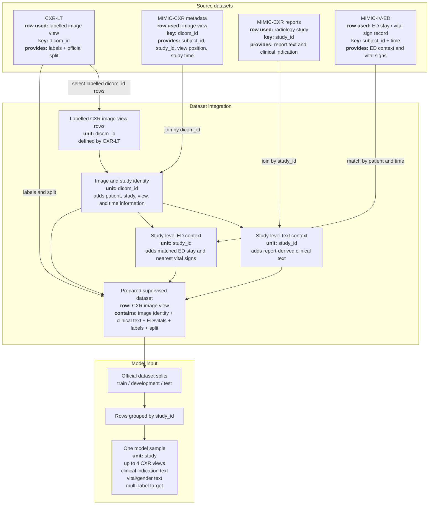

```mermaid
flowchart LR
    %% =========================
    %% Base datasets
    %% =========================
    subgraph A["Base datasets"]
        MIMIC_META["MIMIC-CXR metadata<br/>row: image view<br/>fields: subject_id, study_id, dicom_id, view position, study time"]

        MIMIC_REPORTS["MIMIC-CXR radiology reports<br/>row: study<br/>fields: findings, impression, indication, history"]

        MIMIC_ED["MIMIC-IV-ED records<br/>row: ED stay or vital-sign event<br/>fields: subject_id, stay_id, time"]

        CXRLT["CXR-LT labels and official splits<br/>row: image view<br/>fields: dicom_id, split, disease labels"]
    end

    %% =========================
    %% Study-level context
    %% =========================
    subgraph B["Study-level clinical context"]
        STUDY_BASE["CXR study timeline<br/>row: study<br/>deduplicated studies ordered within each patient"]

        REPORT_CONTEXT["Report-derived text<br/>row: study<br/>clinical indication and selected report text"]

        ED_CONTEXT["Matched ED context<br/>row: study<br/>closest ED stay for the same patient"]

        VITAL_CONTEXT["Matched vital signs<br/>row: study<br/>nearest vital-sign record within the matched ED stay"]

        STUDY_CONTEXT["Merged study context<br/>row: study<br/>CXR metadata + report text + ED context + vital signs"]
    end

    %% =========================
    %% Image-view supervised rows
    %% =========================
    subgraph C["Supervised image-view dataset"]
        VIEW_EXPANSION["Expand study context to image views<br/>row: image view<br/>one study may contain multiple CXR views"]

        LABELLED_ROWS["Attach CXR-LT supervision<br/>row: image view<br/>labels and split assigned by dicom_id"]
    end

    %% =========================
    %% Final prepared splits
    %% =========================
    subgraph D["Prepared dataset splits"]
        TRAIN["Training split<br/>row: image view"]
        DEV["Development split<br/>row: image view"]
        TEST["Test split<br/>row: image view"]
    end

    %% =========================
    %% Model input view
    %% =========================
    subgraph E["Model input view"]
        GROUP_BY_STUDY["Group image-view rows by study_id"]

        MODEL_SAMPLE["One model sample<br/>row: study<br/>up to 4 CXR views<br/>clinical indication text<br/>vital/gender text<br/>multi-label target"]
    end

    %% Base dataset connections
    MIMIC_META -->|"subject_id, study_id, study time"| STUDY_BASE
    MIMIC_REPORTS -->|"study_id"| REPORT_CONTEXT
    MIMIC_ED -->|"subject_id and time"| ED_CONTEXT
    MIMIC_ED -->|"stay_id and chart time"| VITAL_CONTEXT
    CXRLT -->|"dicom_id, split, labels"| LABELLED_ROWS

    %% Study-level alignment
    STUDY_BASE --> ED_CONTEXT
    ED_CONTEXT --> VITAL_CONTEXT

    STUDY_BASE --> STUDY_CONTEXT
    REPORT_CONTEXT --> STUDY_CONTEXT
    ED_CONTEXT --> STUDY_CONTEXT
    VITAL_CONTEXT --> STUDY_CONTEXT

    %% Image-view supervised dataset
    STUDY_CONTEXT -->|"study_id"| VIEW_EXPANSION
    MIMIC_META -->|"study_id, dicom_id, view position"| VIEW_EXPANSION

    VIEW_EXPANSION --> LABELLED_ROWS

    %% Final split outputs
    LABELLED_ROWS -->|"split = train"| TRAIN
    LABELLED_ROWS -->|"split = development"| DEV
    LABELLED_ROWS -->|"split = test"| TEST

    %% Training consumption
    TRAIN --> GROUP_BY_STUDY
    DEV --> GROUP_BY_STUDY
    TEST --> GROUP_BY_STUDY

    GROUP_BY_STUDY --> MODEL_SAMPLE
```

```mermaid
flowchart TB
    %% =====================================================
    %% Source datasets
    %% =====================================================
    subgraph S["Source datasets"]
        CXRLT["CXR-LT<br/><b>row used:</b> labelled image view<br/><b>key:</b> dicom_id<br/><b>provides:</b> labels + official split"]

        META["MIMIC-CXR metadata<br/><b>row used:</b> image view<br/><b>key:</b> dicom_id<br/><b>provides:</b> subject_id, study_id, view position, study time"]

        REPORT["MIMIC-CXR reports<br/><b>row used:</b> radiology study<br/><b>key:</b> study_id<br/><b>provides:</b> report text and clinical indication"]

        ED["MIMIC-IV-ED<br/><b>row used:</b> ED stay / vital-sign record<br/><b>key:</b> subject_id + time<br/><b>provides:</b> ED context and vital signs"]
    end

    %% =====================================================
    %% Dataset integration
    %% =====================================================
    subgraph I["Dataset integration"]
        BASE_ROWS["Labelled CXR image-view rows<br/><b>unit:</b> dicom_id<br/>defined by CXR-LT"]

        IMAGE_IDENTITY["Image and study identity<br/><b>unit:</b> dicom_id<br/>adds patient, study, view, and time information"]

        STUDY_TEXT["Study-level text context<br/><b>unit:</b> study_id<br/>adds report-derived clinical text"]

        CLINICAL_CONTEXT["Study-level ED context<br/><b>unit:</b> study_id<br/>adds matched ED stay and nearest vital signs"]

        FINAL_ROWS["Prepared supervised dataset<br/><b>row:</b> CXR image view<br/><b>contains:</b> image identity + clinical text + ED/vitals + labels + split"]
    end

    %% =====================================================
    %% Final use
    %% =====================================================
    subgraph O["Model input"]
        SPLITS["Official dataset splits<br/>train / development / test"]

        GROUPING["Rows grouped by study_id"]

        SAMPLE["One model sample<br/><b>unit:</b> study<br/>up to 4 CXR views<br/>clinical indication text<br/>vital/gender text<br/>multi-label target"]
    end

    %% Source-to-integration links
    CXRLT -->|"select labelled dicom_id rows"| BASE_ROWS
    META -->|"join by dicom_id"| IMAGE_IDENTITY
    REPORT -->|"join by study_id"| STUDY_TEXT
    ED -->|"match by patient and time"| CLINICAL_CONTEXT

    %% Integration flow
    BASE_ROWS --> IMAGE_IDENTITY
    IMAGE_IDENTITY --> STUDY_TEXT
    IMAGE_IDENTITY --> CLINICAL_CONTEXT

    IMAGE_IDENTITY --> FINAL_ROWS
    STUDY_TEXT --> FINAL_ROWS
    CLINICAL_CONTEXT --> FINAL_ROWS
    CXRLT -->|"labels and split"| FINAL_ROWS

    %% Output use
    FINAL_ROWS --> SPLITS
    SPLITS --> GROUPING
    GROUPING --> SAMPLE
```
