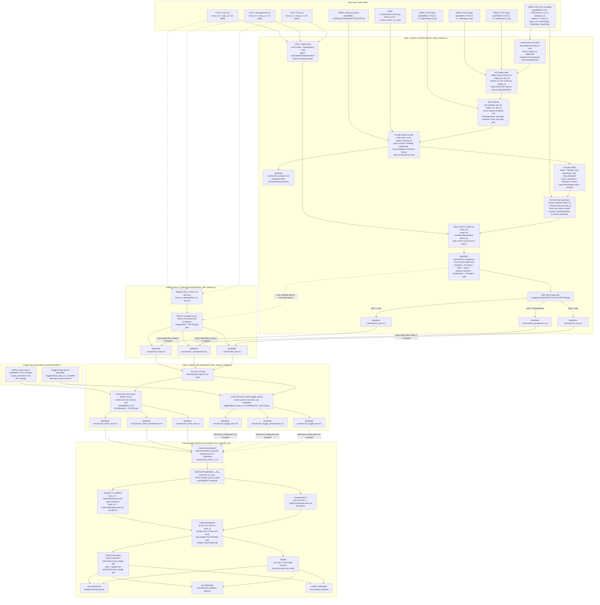

# CaMCheX Dataset Flow

This diagram traces how the raw tables, text reports, labels, and local image files become the train, development, and test CSVs consumed by CaMCheX training.

## Read This Diagram

- `01_make_dataset.py` is the expensive step because it parses every report. Its `01_progress.csv` checkpoint is saved after report parsing so a late crash does not force the slow part to be re-derived manually.
- `02_split_dataset.py` is optional when step 1 finishes normally because step 1 already writes `02_train.csv`, `02_development.csv`, and `02_test.csv`. Run step 2 when you want to rebuild splits from `01_merged.csv` without reparsing reports.
- `03_filter_existing_images.py` is what makes the CSVs machine-aware. It drops rows whose image file is absent on the selected image source and rewrites `path` values so training can open them from the `camchex/` working directory.
- The active default training files are `03_mimic_train.csv`, `03_mimic_development.csv`, and `03_mimic_test.csv`, because those are the paths in `camchex/config.yaml`. The Kaggle `03_kaggle_*` files are alternate outputs if that source directory exists and the config is changed to point at them.
- `CaMCheXDataset` groups the final CSV rows by `study_id`, so the dataloader returns one study sample with up to four image views, view-position IDs, clinical indication tokens, vitals/gender tokens, and the 26-label target vector.
- The merged CSVs retain a cleaned `report` column, but the current `CaMCheXDataset` returns `clinical_indication` and vitals/gender text, not the full `report` text.
