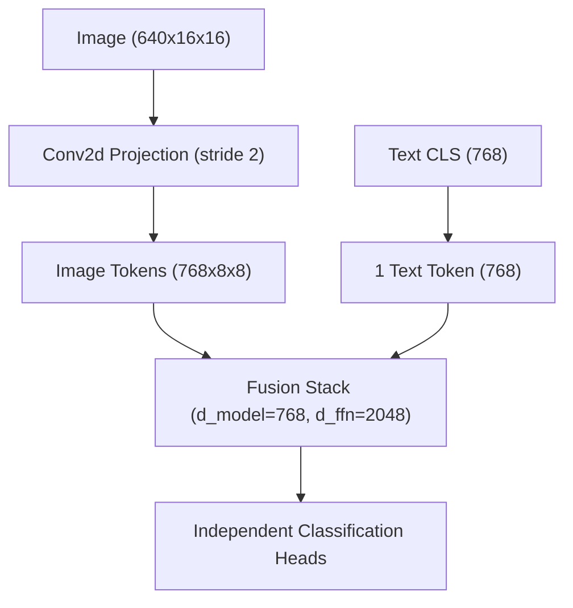
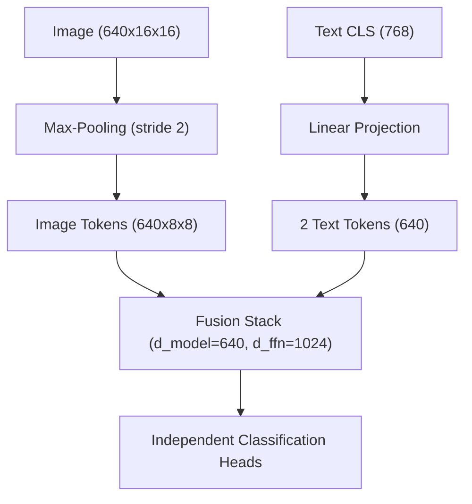

# CaMCheX Model Comparison Report: v5 vs. v6

This document provides a comprehensive comparison of the **v5** and **v6** model architectures in the prior-aware training pipeline. It tracks the evolution of the model from the high-capacity baseline (v5) to the regularization and dimension-squeeze changes in v6 designed to combat overfitting.

---

## 1. Architectural Workflows

Below are the detailed workflows and parameter paths for each model version:

### CaMCheX Prior-Aware v5 Nano (High-Capacity Baseline)

### CaMCheX Prior-Aware v6 Nano (Capacity Squeeze)

---

## 2. Feature Comparison Matrix

| Architectural Feature | v5 Nano | v6 Nano |
| :--- | :--- | :--- |
| **Fusion Bus Width (`d_model`)** | $768$ | $640$ (Native ConvNeXt-Nano width) |
| **Image Feature Path** | Learned `Conv2d(640->768, stride 2)` (~$4.4\text{M}$ params) | Spatial Max-Pooling ($16\times16 \rightarrow 8\times8$, $0$ params) |
| **Text Embedding Tokens** | $1$ token (CXR-BERT CLS) | $2$ tokens (via `Linear(768 -> 2 * 640)`) |
| **FFN Intermediate Dim (`dim_feedforward`)** | $2048$ (Implicit default) | $1024$ (Halved parameter footprint) |
| **Stochastic Depth (`drop_path_rate`)** | $0.0$ (Off) | $0.15$ (On) |
| **Context Bottleneck** | None | $64$ (Squeezes non-image context) |
| **Classification Head** | Independent classification heads | Independent classification heads |

---

## 3. Deep-Dive: Fusion Head Dimension Squeezing

The v5 architecture suffered from overfitting due to excess parameter capacity in the fusion layers. The v6 release addressed this by applying dimension constraints to both the hidden dimension (`d_model`) and the feed-forward network dimension (`dim_feedforward`/`fusion_ffn_dim`).

### 3.1. Bus Width Dimension (`d_model = 640`)
In v5, the hidden dimension was set to $768$ to match CXR-BERT's embedding space. In v6, this is reduced to $640$ to match the native channel output size of the `ConvNeXtV2-Nano` image backbone.

* **Attention Projection Savings:** 
  For any standard multi-head attention layer, the projection matrices for Queries ($W_Q$), Keys ($W_K$), Values ($W_V$), and Output ($W_O$) scale quadratically with `d_model`.
  * **v5 ($768$):** $4 \times (768 \times 768) = 2,359,296$ parameters per attention block.
  * **v6 ($640$):** $4 \times (640 \times 640) = 1,638,400$ parameters per attention block.
  * **Reduction:** $\approx 31\%$ reduction in attention parameters.

---

### 3.2. Narrower FFN Dimension (`dim_feedforward = 1024`)
Each transformer decoder layer contains a Feed-Forward Network (FFN) block consisting of two linear transformations with a non-linear activation in between.

$$\text{FFN}(x) = \text{GELU}(x W_1 + b_1) W_2 + b_2$$

* **v5 (Implicit Default = $2048$):** 
  * $W_1 \in \mathbb{R}^{d_{model} \times d_{ffn}} = 768 \times 2048$ (~$1.57\text{M}$ params)
  * $W_2 \in \mathbb{R}^{d_{ffn} \times d_{model}} = 2048 \times 768$ (~$1.57\text{M}$ params)
  * **Total FFN size per layer:** $\approx 3.14\text{M}$ parameters.
* **v6 (Configured Knob = $1024$):**
  * $W_1 \in \mathbb{R}^{d_{model} \times d_{ffn}} = 640 \times 1024$ (~$0.66\text{M}$ params)
  * $W_2 \in \mathbb{R}^{d_{ffn} \times d_{model}} = 1024 \times 640$ (~$0.66\text{M}$ params)
  * **Total FFN size per layer:** $\approx 1.31\text{M}$ parameters.
* **Reduction:** $\approx 58\%$ parameter reduction in the feed-forward blocks inside both the `prior_pooler` (Perceiver-style pooling) and the `fusion` transformer layers.
