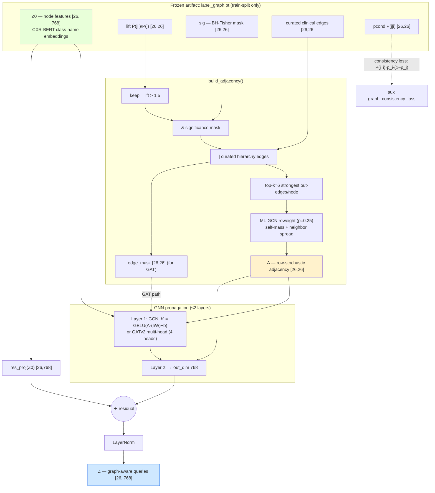
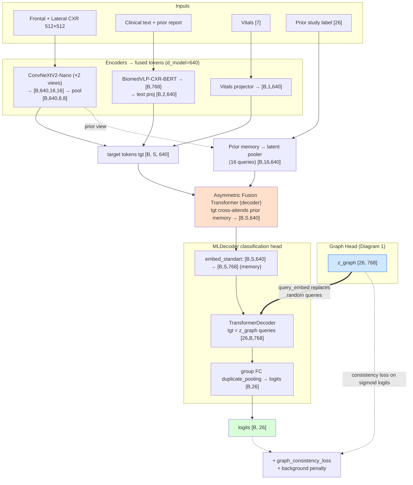

# Prior-Aware v8 Nano — Graph Head Architecture

This document describes the architecture of the **graph head** (`LabelGraphHead`) in
the `prior_aware_v8nano` model variant and how it integrates into the main model.

- Graph head: [src/model/graph_head.py](../src/model/graph_head.py)
- Main model: [src/model/PriorAwareV8NanoModel.py](../src/model/PriorAwareV8NanoModel.py)
- Classification head: [src/decoder/MLDecoder.py](../src/decoder/MLDecoder.py)
- Config: [training/prior_aware_v8nano/config.yaml](../training/prior_aware_v8nano/config.yaml)

## The idea behind it (motivation)

For the full design rationale see [prior_aware_v8_label_graph.md](prior_aware_v8_label_graph.md);
this is the short version.

**The problem.** CXR-LT labels are mined from free-text radiology reports, not from
pixel-level annotation, so they are **noisy** — NLP-labeler errors, uncertainty collapse
("possible nodule" → 1/0), report→image broadcast (a study's labels copied to every view),
and co-mention artifacts. Crucially the noise is *heteroscedastic* (worst on the rare tail
classes the model most needs help with) and *structured* (correlated errors, not random).

**The reframe.** Don't trust the labels one image at a time — trust the **population-level
co-occurrence structure**, which is far more stable than any single label. Inject that
structure as a *structured prior on the classification head* so the head can no longer treat
the 26 classes as independent. Clinically correlated classes then share representation, and a
single noisy positive can't push one class around without consequences for its neighbors.
This makes v8 a **noise-robustness** contribution, not just a long-tail trick.

**The catch, and the defenses.** The co-occurrence structure is *itself* estimated from the
noisy labels, so a naively-built graph would faithfully encode labeler behavior (it would be
a noise *amplifier* rather than a *denoiser*). The graph is therefore built with the noise
modeled explicitly, all before the adjacency is frozen:

- **Bayesian shrinkage** of `P(j|i)` toward the base rate `P(j)` — kills high-variance
  spurious edges minted from a handful of rare-class positives.
- **BH-corrected significance** + **lift threshold / top-k** sparsification — keeps only
  well-evidenced edges and stops the genuine high-lift tail edges from being diluted in a
  dense "everything mildly co-occurs" blob.
- **Curated clinical-hierarchy edges** — hand-encode the few ontology relations (e.g. the
  air-leak family) instead of inferring them from co-mention artifacts.
- **Confidence-weighted edges + ML-GCN self-mass reweight + ≤2 layers + residual** — so a
  confident neighborhood can't wash out a node's own identity, and correlated errors aren't
  over-propagated (the over-smoothing / amplification guard).

**Why it lives on the head queries.** The MLDecoder uses one learnable query vector per
class. v8 replaces those frozen-random queries with `z_graph` — class embeddings produced by
propagating CXR-BERT class-name node features over the cleaned graph. The structure is thus
applied exactly where the per-class decision is made, leaving the encoder/fusion (and the
Grad-CAM hooks) untouched. An optional soft *consistency loss* (off by default) can further
push predicted probabilities to respect the graph.

**Leakage note.** The graph is built from the train split only, frozen to a `.pt` artifact
before training; dev/test labels never enter it.

## Key idea

The graph head runs independently of the per-sample forward pass. It propagates the
frozen 26-class node embeddings (`Z0`) over a learned, clinically-pruned
label-correlation graph to produce `z_graph [26, 768]`. These vectors **replace the
MLDecoder's frozen random query vectors**, so each class query carries shared structure
from its clinically correlated neighbors. The fused image/text/vitals/prior tokens
become the decoder memory, and the decoder attends those graph-aware queries against
them to emit the 26 logits.

Defaults from config: `head_mode: graph`, `gnn: gcn` (GAT path shown dashed),
`graph_consistency_lambda: 0.0` (aux loss wired but off by default).

## Diagram 1 — Inside the Graph Head (`LabelGraphHead`)

## Diagram 2 — Graph Head in the Main v8 Nano Model

