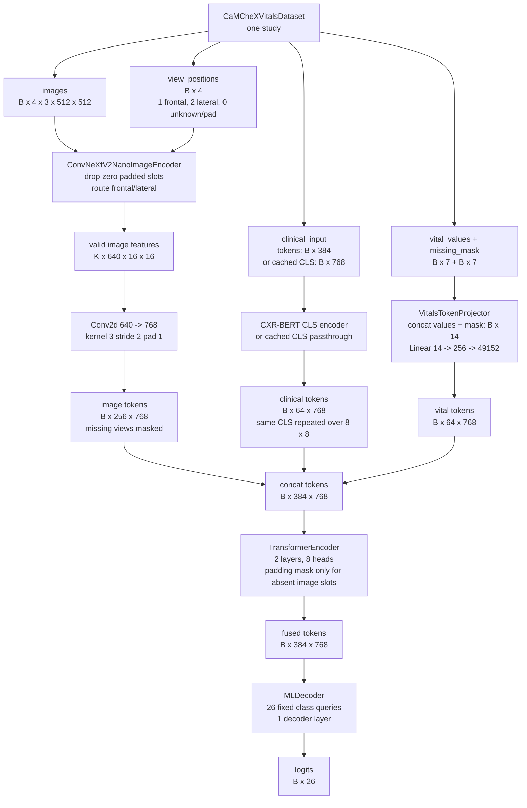

# CaMCheX ConvNeXtV2 Nano + Numeric Vitals

This is an additive CaMCheX variant. It does not change the legacy
`CaMCheXModel`, `CaMCheXDataset`, or existing `training/camchex*` entrypoints.

## What changed

- Image backbone: `convnextv2_nano.fcmae_ft_in22k_in1k_384`.
- Text backbone: `microsoft/BiomedVLP-CXR-BERT-specialized`.
- Text encoder freezing is opt-in by config or `--freeze-text-encoder`.
- Structured ED vitals are numeric features, not observation text.
- Numeric vitals are projected to one 8x8 token block.
- Optional vital dropout masks individual vital fields during training.
- Optional clinical embedding cache can skip repeated frozen CXR-BERT calls.
- Optional decoded image cache can skip repeated JPEG decode while preserving
  train-time augmentations.

## Main files

| Concern | File |
|---|---|
| Model assembly | `src/model/CaMCheXV2NanoVitalsModel.py` |
| Numeric vitals dataset | `src/dataloader/CaMCheXVitalsDataset.py` |
| Train script | `training/camchex_v2nano_vitals/camchex_v2nano_vitals_train.py` |
| Eval script | `training/camchex_v2nano_vitals/camchex_v2nano_vitals_eval.py` |
| Config | `training/camchex_v2nano_vitals/config.yaml` |
| Decoded image cache script | `scripts/precompute_image_cache.py` |
| Grad-CAM / attribution | `src/interpret/{attribution,visualize,run_gradcam}.py` |

## How the model works

`CaMCheXV2NanoVitalsModel` is a three-modality fusion model. It reads up to four
CXR views for one study, one clinical indication text, and seven structured ED
vital fields. All modalities are converted to 768-d tokens, fused with a small
Transformer encoder, then decoded into 26 multi-label logits with ML-Decoder.

With the default config, image size is 512 and the token layout is:

```text
image views:       4 views * 8 * 8 = 256 tokens
clinical text:     1 CLS  * 8 * 8 =  64 repeated CLS tokens
numeric vitals:    1 MLP  * 8 * 8 =  64 learned vital tokens
total max:                            384 tokens
token width:                           768
output logits:                          26
```



### Batch contract

The dataset groups rows by `study_id` and returns one study-level sample:

| Field | Meaning | Shape before batching | Batched shape |
|---|---|---:|---:|
| `study_id` | Study identifier. | scalar/string | list length `B` |
| `img` | Up to four transformed CXR images, zero-padded to four views. | `4 x 3 x 512 x 512` | `B x 4 x 3 x 512 x 512` |
| `view_positions` | View IDs: `1` frontal AP/PA, `2` lateral/LL, `0` unknown or pad. | `4` | `B x 4` |
| `clinical_input_ids` | Either token IDs or a cached float CLS embedding. | `384` or `768` | `B x 384` or `B x 768` |
| `clinical_attention_mask` | Text attention mask; dummy length-1 mask when cached embeddings are used. | `384` or `1` | `B x 384` or `B x 1` |
| `vital_values` | Normalized numeric vitals. | `7` | `B x 7` |
| `vital_missing_mask` | `True` when the source vital is missing. The model can add training-time vital dropout later. | `7` | `B x 7` |
| `label` | CXR-LT multi-hot target. | `26` | `B x 26` |

### Image path

`ConvNeXtV2NanoImageEncoder` owns two independent `TimmImageEncoder` backbones:
one for frontal views and one for lateral views. The input is flattened from
`B x 4 x 3 x 512 x 512` to `(B*4) x 3 x 512 x 512`, zero-padded image slots are
removed, and the remaining slots are routed by `view_positions`.

For the default 512 px input, ConvNeXtV2 Nano produces:

```text
valid image slots K:              K <= B * 4
ConvNeXtV2 Nano output:           K x 640 x 16 x 16
image projection Conv2d:          640 -> 768, kernel 3, stride 2, padding 1
projected image features:         K x 768 x 8 x 8
after reinserting padded slots:    B x 4 x 768 x 8 x 8
flattened image tokens:           B x 256 x 768
```

The model adds 2D positional encoding after the projection. It also adds one of
four learned image segment embeddings, one per image slot. Zero-padded image
slots become learned `padding_token` blocks and are masked before fusion.
Unknown-but-nonzero view images use `view_position=0`; they are not masked, but
they also do not pass through either the frontal or lateral backbone in the
current router.

The model has a local Nano image router because the older shared
`CaMCheXImageEncoder` preallocates 768-channel features for ConvNeXt Tiny, while
ConvNeXtV2 Nano emits 640 channels before projection.

### Clinical text path

Clinical indication text has two possible input forms:

| Mode | Dataset output | Model behavior | Feature shape |
|---|---|---|---:|
| Live text encoder | token IDs and attention mask | Run `microsoft/BiomedVLP-CXR-BERT-specialized` and take CLS. | `B x 768` |
| Cached embedding | float CLS tensor | Skip CXR-BERT and use the tensor directly. | `B x 768` |

The model then adds the clinical segment embedding and expands the single CLS
vector to an `8 x 8` block:

```text
clinical CLS:         B x 768
expanded clinical:    B x 64 x 768
```

This expansion keeps the clinical stream the same token count as the vitals
stream and one image-view feature map. It does not create 64 distinct text
features; the 64 clinical tokens start as repeated copies of the same CLS vector
before fusion attention mixes them with image and vital tokens.

### Numeric vitals path

The dataset emits seven fields:

```text
temperature, heartrate, resprate, o2sat, sbp, dbp, gender
```

Each observed value is normalized with `vital_stats`. Missing values are encoded
as normalized value `0.0` plus `missing=True`. Gender is encoded as male `1.0`,
female `0.0`, then normalized with the gender stats. During training,
`vital_dropout_p` can randomly mask individual fields by setting their value to
`0.0` and OR-ing their missing bit.

`VitalsTokenProjector` concatenates values and masks, then projects one study's
structured vitals into an `8 x 8` token block:

```text
vital_values:                 B x 7
vital_missing_mask:           B x 7
concat(values, mask):         B x 14
Linear + GELU + Dropout:      B x 256
Linear to 64 * 768:           B x 49152
vital tokens:                 B x 64 x 768
```

### Fusion and classifier head

The three token streams are concatenated in fixed order:

```text
image tokens:       B x 256 x 768
clinical tokens:    B x  64 x 768
vital tokens:       B x  64 x 768
all tokens:         B x 384 x 768
```

The padding mask has shape `B x 384`. It masks only absent image-view tokens.
Clinical and vital tokens are always marked valid, even when clinical text is
empty or every vital field is missing, because those conditions are represented
inside the token values.

Fusion uses:

```text
TransformerEncoderLayer(d_model=768, nhead=8, dropout=0.1, batch_first=True)
num_layers = 2
input/output = B x 384 x 768
```

The fused tokens go to `MLDecoder(num_classes=26, initial_num_features=768)`.
In this configuration, ML-Decoder uses 26 fixed query embeddings, one decoder
layer, 8-head cross-attention over the fused memory, and a grouped fully
connected output layer. The memory is first passed through `Linear(768, 768)`
plus ReLU, so its shape stays the same:

```text
fused memory:            B x 384 x 768
memory projection:       B x 384 x 768
class query embeddings:  26 x 768
decoder hidden:          B x 26 x 768
logits:                  B x 26
```

The logits are trained as independent multi-label disease outputs, not a
softmax over mutually exclusive classes.

## Vitals

The dataset emits seven structured fields:

```text
temperature, heartrate, resprate, o2sat, sbp, dbp, gender
```

Each field is normalized and paired with a missing-mask bit. Missing values are
encoded as value `0.0` plus `missing=True`. During training,
`vital_dropout_p` can randomly mask individual fields using the same mechanism.

Config knobs:

```yaml
model:
  model_init_args:
    vital_dropout_p: 0.1
    vitals_dropout: 0.1
    vitals_hidden_dim: 256
data:
  datamodule_cfg:
    vital_stats:
      temperature: {mean: 98.6, std: 3.0}
```

`vital_stats` is optional. If omitted, the dataset uses conservative defaults
from `CaMCheXVitalsDataset.py`.

## Train

```bash
python training/camchex_v2nano_vitals/camchex_v2nano_vitals_train.py \
  --train-df-path data/subset/labels/train.csv \
  --val-df-path data/subset/labels/val.csv \
  --test-df-path data/subset/labels/test.csv \
  --batch-size 4 \
  --max-epochs 30
```

For an offline or shape-only smoke run, disable timm pretrained image weights:

```bash
python training/camchex_v2nano_vitals/camchex_v2nano_vitals_train.py \
  --train-df-path data/subset/labels/train.csv \
  --val-df-path data/subset/labels/val.csv \
  --test-df-path data/subset/labels/test.csv \
  --no-pretrained \
  --fast-dev-run
```

CXR-BERT still needs to be available from Hugging Face or local cache on the
first run that misses the shared text embedding cache.

## Eval

```bash
python training/camchex_v2nano_vitals/camchex_v2nano_vitals_eval.py \
  --checkpoint-path output/camchex_v2nano_vitals/runs/<run>/checkpoints/best.pt \
  --test-df-path data/subset/labels/test.csv
```

Predictions default to:

```text
output/camchex_v2nano_vitals/predictions.csv
output/camchex_v2nano_vitals/metrics.json
```

## Grad-CAM / Attribution

Per-class attribution panels show *where* a prediction came from across all three
modalities from a single `logit.backward()`:

- image: Grad-CAM heatmap on each CXR view's ConvNeXtV2 feature map,
- text: grad x input-embedding per CXR-BERT token (per-word highlighting),
- vitals: signed grad x value per vital, plus a rough modality-share bar.

Each class writes three PNGs you can inspect by hand:
`<Class>/{image,text,vitals}.png`.

### During training (default: on, every epoch)

After each epoch's validation, the trainer reuses the validation logits (no extra
scan) to pick, per class, two representative studies and dumps panels to:

```text
<run_dir>/gradcam/epoch_<N>/
  best/<Class>/{image,text,vitals}.png    # highest-confidence true positive (varies per epoch)
  first/<Class>/{image,text,vitals}.png   # first true positive in val order (FIXED across epochs)
```

Flip through `epoch_*/first/<Class>/image.png` to watch one fixed study's heatmap
evolve as training progresses. Control with:

```bash
# default is every epoch; restrict, disable, or move off CPU as needed
python training/camchex_v2nano_vitals/camchex_v2nano_vitals_train.py \
  --gradcam-epochs 0,4,9   # or 'all' (default) / 'none'
  --gradcam-device cuda    # default cpu (the dump runs in a subprocess to protect GPU memory)
```

The dump forces the live CXR-BERT path (cache off, grads on) so per-word text
attribution works even if you train with cached embeddings; predictions are identical.

### Standalone (any checkpoint)

```bash
python -m src.interpret.run_gradcam \
  --config training/camchex_v2nano_vitals/config.yaml \
  --checkpoint-path output/camchex_v2nano_vitals/runs/<run>/checkpoints/best.pt \
  --split val --scan-limit 800
```

Here it scans the split for the highest-confidence true positive per class. A study
with multiple findings gets a class-conditional panel under each class it is positive
for; the panel header lists the co-occurring labels.

## Optional Clinical Embedding Cache

When the text encoder is frozen, clinical indication CLS embeddings can be
cached automatically by the train/eval data path. There is no separate
precompute command for this model. Enable it with
`--use-precomputed-text-embeddings` or the config flags below. The loader then
gathers the needed `study_id -> clinical_indication` texts, computes only cache
misses, and feeds float CLS embeddings to the model so CXR-BERT does not need to
stay loaded during training.

```bash
python training/camchex_v2nano_vitals/camchex_v2nano_vitals_train.py \
  --use-precomputed-text-embeddings \
  --text-embedding-cache-dir data/text_embeddings
```

```yaml
model:
  model_init_args:
    freeze_text_encoder: true
    use_precomputed_text_embeddings: true
data:
  datamodule_cfg:
    use_text_embedding_cache: true
    text_embedding_cache_dir: data/text_embeddings
    text_embedding_batch_size: 32
    text_embedding_device: auto
```

The shared cache is grouped by embedding model:

```text
data/text_embeddings/<embedding-model-name>-<model-hash>/
  metadata.json
  embeddings/<key-prefix>/<cache-key>.npy
```

Each entry key also includes the text model, max token length, and raw text, so
the same cache root can be shared across model variants that use the same frozen
text backbone. The train/eval dataset streams one `.npy` vector per sample
instead of loading every cached embedding into memory at startup.

For prior-aware text embedding caches, use:

```bash
python src/prepare/04_build_prior_aware_dataset.py \
  --tokenizer microsoft/BiomedVLP-CXR-BERT-specialized \
  --precompute-text-embeddings
```

That builder writes the embedded current/prior text streams into parquet, but
the underlying frozen CLS embeddings are still read from and written to the same
shared `data/text_embeddings/...` cache.

## Optional Decoded Image Cache

This cache stores decoded RGB uint8 arrays, not final normalized tensors. That
means JPEG decode is skipped, but Albumentations can still apply random
train-time transforms each epoch.

```bash
python scripts/precompute_image_cache.py \
  --input-csv data/data-camchex/03_mimic_train.csv \
  --input-csv data/data-camchex/03_mimic_development.csv \
  --input-csv data/data-camchex/03_mimic_test.csv \
  --cache-dir data/data-camchex/image_cache_rgb
```

Then set:

```yaml
data:
  datamodule_cfg:
    image_cache_dir: data/data-camchex/image_cache_rgb
```

The cache is keyed by resolved image path. Moving the cache to a machine with
different absolute paths may cause misses; the dataset falls back to JPEG decode
on a miss.

## Augmentation

Train-time augmentations live in `src/dataloader/utils.py::get_transforms`. The
rotation/shift/scale step uses `A.Affine`, which replaced the deprecated
`A.ShiftScaleRotate`. The current parameters are a faithful 1:1 of the old
`ShiftScaleRotate` defaults, so the augmentation distribution is unchanged:

```python
A.Affine(
    translate_percent=(-0.0625, 0.0625),  # = shift_limit 0.0625
    scale=(0.9, 1.1),                      # = scale_limit 0.1
    rotate=(-45, 45),                      # = rotate_limit 45
    border_mode=cv2.BORDER_REFLECT_101,
    p=0.5,
)
```

### Planned ablation: rotation range

The baseline keeps `rotate=(-45, 45)` to match the original CaMCheX recipe. This
is far wider than clinically realistic — frontal/lateral CXRs are acquired
near-upright, and most MIMIC-CXR / CheXpert pipelines use `±5°–±15°`. `±45°`
forces rotation invariance the model never needs at test time, and with
`BORDER_REFLECT_101` fill it synthesizes anatomically impossible mirrored tissue
in the corners, which can hurt rare-class signal in this long-tailed (26-class)
setting.

**Ablation to run:** swap `rotate=(-45, 45)` for `rotate=(-10, 10)` (keep all
else fixed) and compare val/test `AP`. Run the baseline first so the effect is
measured, not silently changed.

## Compatibility Notes

- Existing CaMCheX train/eval scripts are unchanged.
- Existing CaMCheX datasets still return their old observation-text tuple.
- Stage-1 frontal/lateral checkpoint paths must be ConvNeXtV2 Nano weights for
  this model. Old ConvNeXt Tiny stage-1 weights are not shape-compatible.
- The config uses the timm registry name without the `timm/` prefix because this
  repo passes `model_name` directly to `timm.create_model`.
