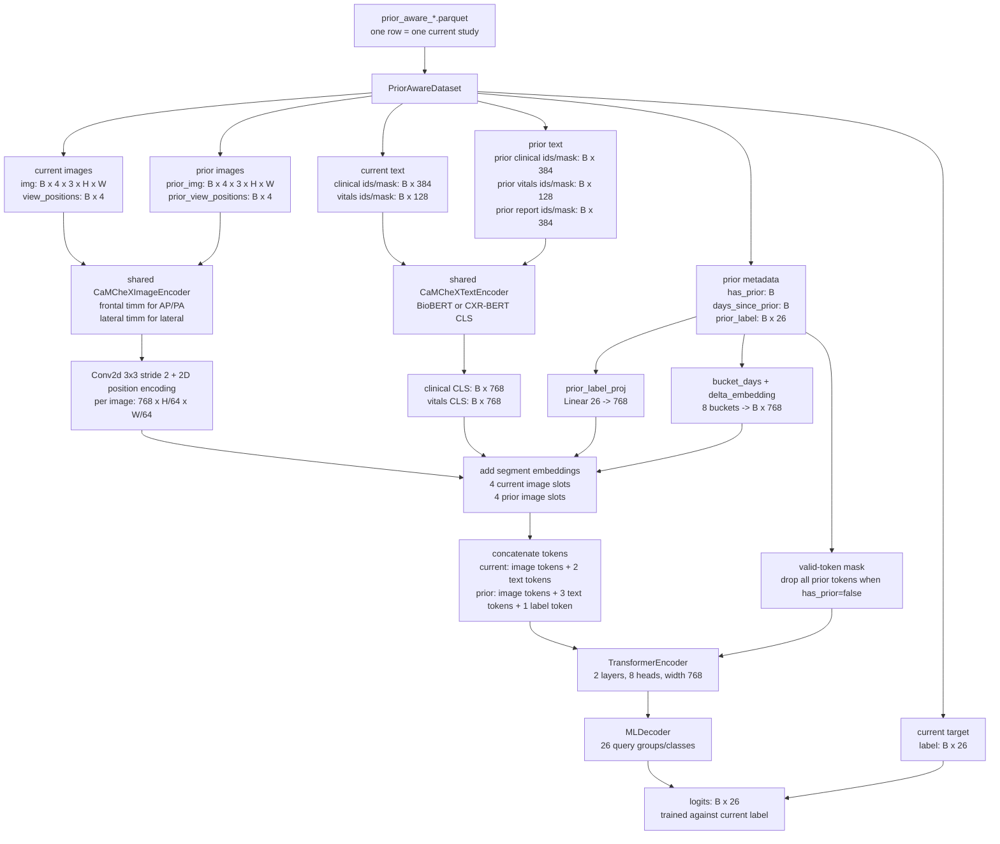

# Prior-Aware CaMCheX

## Quick start

```bash
# 0. build the shared prior-aware parquet once (no --tokenizer; tokenized at load)
python src/prepare/04_build_prior_aware_dataset.py

# 1. train (BioBERT frozen via the text-embedding cache; EMA + single-cosine)
python training/prior_aware/prior_aware_train.py \
  --use-precomputed-text-embeddings --ema --batch-size 4 --num-workers 4

# 2. eval (two passes: full vs. CURRENT clinical-indication dropped; prior text kept)
python training/prior_aware/prior_aware_eval.py \
  --checkpoint-path <ckpt> --use-precomputed-text-embeddings
```

Tune `--batch-size` / `--num-workers` to your GPU; leave `val_num_workers` at 0; don't
`--resume-from` an EMA checkpoint. (CXR-BERT variant: same commands under
[`training/prior_aware_cxrbert/`](../prior_aware_cxrbert/).)

This path trains a CaMCheX variant that sees the current study plus the nearest
previous study for the same patient.

The prior study additionally contributes its **full radiology report** (findings +
impression) as its own token. The report is label leakage for the *current* study
(it states the findings being classified) and is never fed there, but the *prior*
study's report was authored before this exam, so it is legitimate prior
information — a previous radiologist's read of this patient's chest.

## How Prior Context Rows Are Built

The prior-aware parquet has one row per current study. It does not create every
pairwise combination of a patient's history.

For a patient with four chronological studies:

```text
study_1
study_2
study_3
study_4
```

the training rows are:

```text
study_1 -> no prior
study_2 -> prior = study_1
study_3 -> prior = study_2
study_4 -> prior = study_3
```

So the meaningful prior pairs are `2<-1`, `3<-2`, and `4<-3`. The first study
still appears as a row, but its prior branch is masked.

## Build The Parquet

The builder stores **raw text columns only** (`clin_text`, `obs_text`,
`prior_clin_text`, `prior_obs_text`, `prior_report_text`) — no baked token ids and
no frozen CLS embeddings. Tokenization happens at load time with the training
config's tokenizer, so **one parquet serves every text model** (BioBERT, CXR-BERT,
…) with no `--tokenizer` argument and no rebuild when you switch variants:

```bash
python src/prepare/04_build_prior_aware_dataset.py
```

> **Rebuild required.** The schema changed: the prior radiology report
> (`prior_report_text`) was added and the baked `*_input_ids`/`*_attn_mask` columns
> were dropped in favor of load-time tokenization. Parquets built before this change
> are incompatible — re-run the builder above to regenerate
> `prior_aware_{train,development,test}.parquet`.

## Tokenized Versus Cached

Default live text path:

```text
raw text in parquet
-> PriorAwareDataset tokenizes at load with the config's tokenizer
   (model.text_model / data.tokenizer; not cached -- keeps RAM low)
-> model loads and runs BioBERT/CXR-BERT during training
```

Optional frozen cached path:

```text
CSV text stored in parquet
-> training loader fills shared TextEmbeddingCache misses
-> dataset streams CLS embeddings per sample
-> model does not load BioBERT/CXR-BERT during training
```

Caching is only appropriate when the text backbone is frozen. If the text
backbone is trainable, embeddings must be recomputed every update, so cached
embeddings would be stale.

## Train With Cached Text Embeddings

Prior-aware rows need five text streams cached:

```text
current clinical
current observation/vitals text
prior clinical
prior observation/vitals text
prior report (findings + impression)
```

The training and eval loaders use the shared frozen text embedding cache under
`data/text_embeddings/<embedding-model-name>-<model-hash>/`, with one `.npy`
file per cached text key. Repeated runs and other model variants reuse
already-computed CLS embeddings for the same text model, max token length, and
raw text.

BioBERT:

```bash
python training/prior_aware/prior_aware_train.py \
  --use-precomputed-text-embeddings \
  --text-embedding-cache-dir data/text_embeddings
```

CXR-BERT:

```bash
python training/prior_aware_cxrbert/prior_aware_train.py \
  --use-precomputed-text-embeddings \
  --text-embedding-cache-dir data/text_embeddings
```

`--use-precomputed-text-embeddings` also implies frozen text behavior and the
model skips constructing the text encoder. The parquet paths stay the normal
`prior_aware_{train,development,test}.parquet` paths.

## Freeze Without Pre-Embedding

This mode still loads BioBERT/CXR-BERT, but keeps it frozen and runs it under
`torch.no_grad()`:

```bash
python training/prior_aware/prior_aware_train.py --freeze-text-encoder
```

This is useful for quick comparison, but if you intend to keep the text encoder
frozen for a real run, precomputed embeddings are usually faster and lighter.

## Model Architecture

The implementation lives in `src/model/PriorAwareCaMCheXModel.py`. It is not a
Siamese classifier that compares two final logits. It converts the current study
and the nearest previous study into one shared token sequence, masks missing
prior tokens, runs a transformer encoder over all valid tokens, then applies
MLDecoder to predict the current study's 26 labels.



### Per-Row Meaning

Each parquet row is a current study. The row carries the current study inputs,
the target label for that current study, and at most one previous study selected
by the stage-3 `PreviousStudy` column.

| Field group | Meaning | Runtime shape |
|---|---|---|
The parquet stores raw text columns; the dataset tokenizes them at load (the
runtime shape column shows the tokenized result for the default live-text path).

| Field group | Meaning | Runtime shape |
|---|---|---|
| `img`, `view_positions` | Up to 4 current CXR images and integer view codes. `1` is frontal, `2` is lateral, `0` is padding/unknown. | `B x 4 x 3 x H x W`, `B x 4` |
| `clin_text` | Current clinical indication, tokenized at load. | `B x 384` ids + mask |
| `obs_text` | Current vitals/observation text, tokenized at load. | `B x 128` ids + mask |
| `label` | Current study multi-label target. Uncertain labels are stored as `0.5`; missing labels become `0`. | `B x 26` |
| `has_prior` | Whether this row has a usable previous study after lookup/dropout. | `B` |
| `prior_img`, `prior_view_positions` | Up to 4 prior-study CXR images and view codes. All zeros when no prior is used. | `B x 4 x 3 x H x W`, `B x 4` |
| `prior_clin_text`, `prior_obs_text` | Prior clinical indication and prior vitals text, tokenized at load. | `B x 384`, `B x 128` |
| `prior_report_text` | Prior radiology report (findings + impression), tokenized at load. Legitimate prior info, not leakage. | `B x 384` |
| `prior_label` | Prior study's 26-label vector. Zeroed when no prior is used. | `B x 26` |
| `days_since_prior` | Current study time minus prior study time, in days. Zeroed when no prior is used. | `B` |

If `--use-precomputed-text-embeddings` or `use_text_embedding_cache: true` is
enabled at train/eval time, the dataset streams cached CLS vectors (keyed on the
raw text) instead of tokenizing for the configured text streams. In that mode the
relevant text tensors are `B x 768`, attention masks are dummy arrays, and the
model does not instantiate BioBERT/CXR-BERT.

### Image Tokens

Both current and prior image blocks use the same `CaMCheXImageEncoder` weights.
The encoder flattens the 4 image slots into `B*4` images, skips all-zero padding
slots, and routes nonzero slots by view code:

| View code | Routed encoder |
|---|---|
| `1` | frontal timm backbone |
| `2` | lateral timm backbone |
| `0` or other | no branch writes a feature; treated as padding/unknown |

The timm backbone is expected to emit `768 x H/32 x W/32` features. The
prior-aware model then applies:

```text
Conv2d(768 -> 768, kernel=3, stride=2, padding=1)
2D positional encoding
segment embedding for the image slot
```

So each image slot becomes `768 x H/64 x W/64`, then is flattened to
`(H/64 * W/64)` tokens of width 768. With the default `size: 512`, one image
slot is `8 x 8 = 64` tokens, and one 4-view block is `4 * 64 = 256` image
tokens.

### Text Tokens

The current clinical indication and current vitals text are encoded by one
shared `CaMCheXTextEncoder`, which wraps one BioBERT/CXR-BERT model and returns
the CLS vector:

```text
clinical input_ids: B x 384 -> clinical CLS: B x 768
vitals input_ids:   B x 128 -> vitals CLS:   B x 768
```

The prior clinical, prior vitals, and prior report streams call the same text
encoder with the prior token ids (the prior report is the prior study's findings +
impression, capped at 384 tokens like the clinical stream). Segment embeddings
distinguish current clinical, current vitals, prior clinical, prior vitals, and
prior report tokens. The prior text tokens also get the time-delta embedding.

### Prior Label And Time Delta

The prior study's disease vector is treated as one extra prior token:

```text
prior_label: B x 26
Linear(26 -> 768)
+ prior-label segment embedding
+ time-delta embedding
= prior label token: B x 768
```

`days_since_prior` is bucketed before embedding:

| Bucket id | Meaning |
|---|---|
| `0` | no prior or unknown |
| `1` | <= 1 day |
| `2` | 2-7 days |
| `3` | 8-30 days |
| `4` | 31-180 days |
| `5` | 181-365 days |
| `6` | 1-3 years |
| `7` | > 3 years |

The selected bucket is embedded as `B x 768` and added to every prior token:
prior image tokens, prior clinical token, prior vitals token, prior report token,
and prior label token. Current-study tokens do not get this delta embedding.

### Fused Sequence Shape

Let:

```text
S = 4 image slots
C = 768
h = H / 64 after timm stride-32 and model stride-2 conv
w = W / 64
I = S * h * w image tokens per current/prior block
```

The fused sequence is:

| Segment | Token count | Shape |
|---|---:|---|
| Current image tokens | `I` | `B x I x 768` |
| Current clinical + vitals | `2` | `B x 2 x 768` |
| Prior image tokens | `I` | `B x I x 768` |
| Prior clinical + vitals + report + label | `4` | `B x 4 x 768` |
| Total | `2I + 6` | `B x (2I + 6) x 768` |

With the default `H = W = 512`, `h = w = 8`, `I = 256`, and the transformer
input is:

```text
B x 518 x 768
```

The model has 14 learned segment embeddings:

```text
0-3   current image slots
4     current clinical token
5     current vitals token
6-9   prior image slots
10    prior clinical token
11    prior vitals token
12    prior label token
13    prior report token
```

Missing image slots are represented by a learned padding token internally but
are masked out before transformer attention. When `has_prior=false`, every
prior image/text/label token is masked, so the model behaves like a current-only
CaMCheX-style classifier for that sample. During training,
`label_dropout_p: 0.3` can randomly force `has_prior=false` for rows that do
have priors; validation and evaluation use `0.0`.

### Fusion And Prediction

The concatenated sequence goes through:

```text
TransformerEncoder(
  layers = 2,
  heads = 8,
  width = 768,
  key_padding_mask = inverse(valid_token_mask)
)
```

The transformer output keeps the same shape, `B x (2I + 6) x 768`. MLDecoder
then attends with class/group queries over the valid memory tokens and returns:

```text
logits: B x 26
```

Those logits are trained against the current study's `label`, not the prior
label. The prior label is only context.

### Biobert Versus CXR-BERT Variants

`training/prior_aware/` and `training/prior_aware_cxrbert/` use the same model
class and data contract. `training/prior_aware_v2nano/` is a separate v2nano
assembly that uses numeric vitals instead of observation-text tokens. The main
differences are config choices:

| Folder | Text model | Image backbone | Vitals path |
|---|---|---|---|
| `training/prior_aware/` | `dmis-lab/biobert-v1.1` | `convnext_small.fb_in22k_ft_in1k` | observation text |
| `training/prior_aware_cxrbert/` | `microsoft/BiomedVLP-CXR-BERT-specialized` | `convnext_tiny.fb_in22k_ft_in1k` | observation text |
| `training/prior_aware_v2nano/` | `microsoft/BiomedVLP-CXR-BERT-specialized` | `convnextv2_nano.fcmae_ft_in22k_in1k_384` | numeric vital tokens |

All variants keep `d_model=768`, two fusion transformer layers, eight attention
heads, and 26 output classes by default.

## Grad-CAM / Attribution

The prior-aware model is a *superset* of the single-study CaMCheX model, so its
attribution reuses the same machinery (`src/interpret/{attribution,visualize}.py`)
through a thin prior-aware wrapper (`src/interpret/{prior_attribution,run_prior_gradcam}.py`)
and adds panels for the prior branch. One `logit.backward()` per class yields:

- **current**: image Grad-CAM per CXR view, clinical-indication token grad×embedding,
  observation/vitals-text token grad×embedding (this base variant has no numeric vitals),
- **prior**: prior-image Grad-CAM, prior clinical + prior observation text, and the
  **prior radiology report** (findings + impression — legitimate prior context, fed only
  for the prior study),
- **prior label**: per-class grad×value over the projected 26-dim prior CheXpert vector
  (`Linear(26→768)` token) — *which prior findings drove the current prediction*,
- **time delta**: grad×embedding on the time-gap bucket token (signed contribution + bucket),
- **modality**: current-vs-prior contribution breakdown across every token group.

Each class writes one folder of inspect-by-hand PNGs:
`<Class>/{image,prior_image,text,cur_obs,prv_clin,prv_obs,prv_report,prior_label,time_delta,modality}.png`.

### During training (default: on, every epoch)

The model declares `gradcam_runner_module = "src.interpret.run_prior_gradcam"`, so after
each epoch's validation the trainer reuses the validation logits (no extra scan) to pick
two representative studies per class and dumps panels to:

```text
<run_dir>/gradcam/epoch_<N>/
  best/<Class>/...    # highest-confidence true positive (varies per epoch)
  first/<Class>/...   # first true positive in val order (FIXED across epochs)
```

Control with `--gradcam-epochs 0,4,9` (or `all`/`none`) and `--gradcam-device cuda`
(default `cpu`; the dump runs in a subprocess to protect GPU memory). Studies without a
prior render placeholder prior panels and a masked time-delta. The dump forces the live
text path (cache off, grads on) so per-token attribution works even if you train with
cached embeddings; predictions are identical.

### Standalone (any checkpoint)

```bash
python -m src.interpret.run_prior_gradcam \
  --config training/prior_aware/config.yaml \
  --checkpoint-path output/prior_aware/runs/<run>/checkpoints/best.pt \
  --split val --scan-limit 800
```
